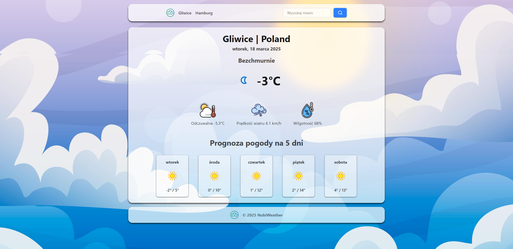

# NubiWeather Project



## Overview

NubiWeather is a weather application that consists of two main parts: the server and the client. The server handles API requests and data processing, while the client provides a user interface for interacting with the weather data.

## Getting Started

### Prerequisites

- Node.js
- npm

### Installation

1. Clone the repository:
    ```sh
    git clone https://github.com/NeckitWin/NubiWeather.git
    ```

### Server Setup

1. Navigate to the `Server` directory:
    ```sh
    cd Server
    ```

2. Install the dependencies:
    ```sh
    npm install
    ```

3. Create a `.env` file in the `server` directory. You can use the `.env.sample` file as a template:
    ```sh
    cp .env.sample .env
    ```

4. Fill in the required environment variables in the `.env` file.
    ```
    WEATHER_API_KEY=your_api_key_here
    ```

5. Start the server:
    ```sh
    npm start
    ```

### Client Setup

1. Navigate to the `Client` directory:
    ```sh
    cd Client
    ```

2. Install the dependencies:
    ```sh
    npm install
    ```

3. Start the client:
    ```sh
    npm start
    ```

4. Build the client for production:
    ```sh
    npm run build
    ```

## Features

### Server

- **Weather Data Fetching**: The server fetches weather data from an external API and provides it to the client.
- **Search Functionality**: The server allows searching for weather data based on city names.

### Client

- **Weather Display**: The client displays current weather conditions and a 5-day forecast.
- **Search Functionality**: Users can search for weather data by entering city names.
- **Autocomplete Search**: The client provides autocomplete suggestions as users type city names.
- **Error Handling**: The client handles and displays error messages received from the server.

## Interaction Between Server and Client

1. **Fetching Weather Data**: The client sends a GET request to the server to fetch weather data for a specific city. The server processes this request, fetches the data from an external API, and returns it to the client.
    ```sh
    GET /api/v1/weather/{city}
    ```

2. **Search Functionality**: When a user searches for a city, the client sends a GET request to the server. The server processes the search query, fetches the relevant data, and returns the search results to the client.
    ```sh
    GET /api/v1/weather/search/{city}
    ```

## Environment Variables

The `.env` file in the `server` directory should contain the following variables:

- `WEATHER_API_KEY`: Your API key for the weather data provider.

Example `.env` file:

```
WEATHER_API_KEY=your_api_key_here # Get your API key at https://www.weatherapi.com/
```

## Conclusion

This project provides a comprehensive weather application with both server and client components. Follow the setup instructions to get the application running and explore the features implemented.